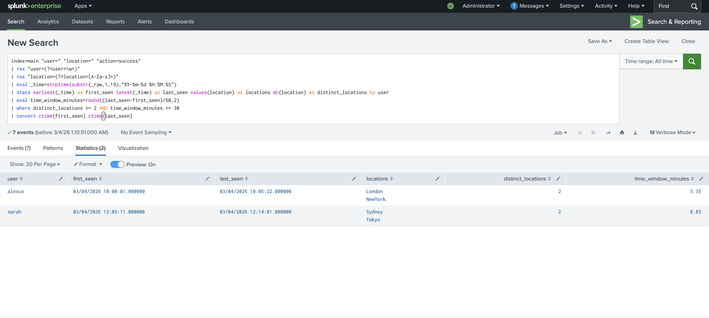
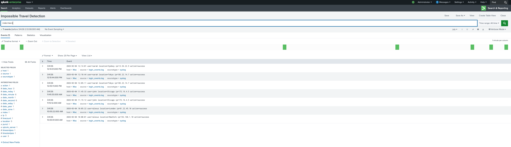

# splunk-impossible-travel
Splunk SIEM lab demonstrating detection of impossible travel authentication events using login log analysis and SPL queries.

## Intial Query Results
This query was ran prior to the creation of the alert.

## Log Ingestion
Authentication logs were ingested into the Splunk main index.

## Detection Query Results
This query identifies users logging in from multiple locations.

## Alert Configuration
A scheduled alert was created to automatically detect impossible travel activity.

