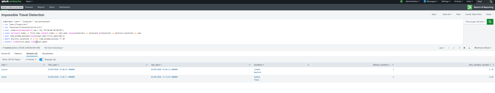
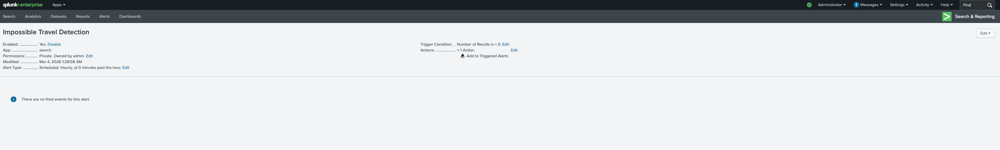

# splunk-impossible-travel
Splunk SIEM lab demonstrating detection of impossible travel authentication events using login log analysis and SPL queries.
Impossible travel occurs when a user appears to log in from geographically distant locations within an unrealistic time window.
The lab simulates authentication logs and uses Splunk SPL queries to identify suspicious login behavior and generate a detection alert.

## Environment
Impossible travel occurs when a user appears to log in from geographically distant locations within an unrealistic time window.
The lab simulates authentication logs and uses Splunk SPL queries to identify suspicious login behavior and generate a detection alert.

## Detection Logic
The detection identifies users logging in from multiple geographic locations within a short time window. This behavior may indicate:
Account compromise
Credential theft
Session hijacking
VPN or proxy abuse

## SPL Detection Query
index=main "user=" "location="
| rex "user=(?<user>\w+)"
| rex "location=(?<location>\w+)"
| eval _time=strptime(_time,"%Y-%m-%d %H:%M:%S")
| stats earliest(_time) as first_seen latest(_time) as last_seen values(location) as locations dc(location) as distinct_locations by user
| eval time_window_minutes=round((last_seen-first_seen)/60,2)
| where distinct_locations >= 2 AND time_window_minutes <= 30
| convert ctime(first_seen) ctime(last_seen)
This query identifies users who log in from multiple locations within a short time window, which could indicate impossible travel.

## Initial Query Results
This query was ran prior to the creation of the alert.

## Log Ingestion
Authentication logs were ingested into the Splunk main index.

## Detection Query Results
This query identifies users logging in from multiple locations.

## Alert Configuration
A scheduled alert was created to automatically detect impossible travel activity.

## Security Impact
Impossible travel detection helps identify potential account compromise or credential misuse by analyzing login patterns across geographic locations.
Organizations commonly deploy this detection as part of:
Security Operations Center (SOC) monitoring
Identity threat detection
User behavior analytics

## Skills Demonstrated
Impossible travel detection helps identify potential account compromise or credential misuse by analyzing login patterns across geographic locations.
Organizations commonly deploy this detection as part of:
Security Operations Center (SOC) monitoring
Identity threat detection
User behavior analytics
